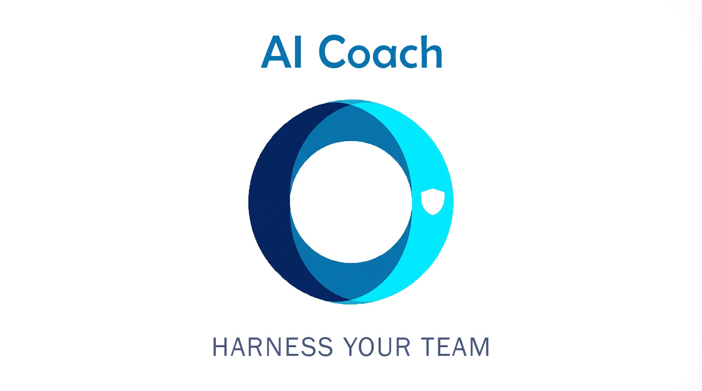

<p align="center">
  
</p>

<p align="center"><b>A coach for using Claude Code well.</b><br>
One focus per release. So far: memory, then prompts.</p>

---

## Why

Every session starts cold. You re-explain the same constraint, rediscover the same trap, and lose
whatever a teammate already worked out on the branch you just checked out. Worse, the moment things
went wrong — the one worth remembering — is the moment nothing records.

AI Coach keeps what a session learned, puts it in front of you next time, and notices when you hit
the same wall twice without writing it down. It also watches how you ask — and, unusually, checks
whether that actually cost you anything before offering an opinion about it.

## Install

Requires **Node ≥ 22.5** (`node:sqlite`). Session-end distillation additionally wants `claude` on
PATH, and degrades quietly without it.

```bash
claude plugin marketplace add MohammedMoataz/ai-coach
claude plugin install ai-coach@ai-coach
```

That one command installs the engine and every coach released so far. The bundle itself ships no
components, so it costs nothing at session start.

Want only part of it: `claude plugin install memory-coach@ai-coach` pulls `ai-coach-core` with it.

## What ships

| Plugin | What it is |
|---|---|
| **ai-coach-core** | The engine. Every hook, the memory database, the secrets guard, the session brief, the prompt detectors. Everything else depends on it. |
| **memory-coach** | Skills only: `/recall`, `/handoff`, `/team`, `/project`, `/name`, `/doctor`. |
| **prompt-coach** | Skills only: `/prompt`, `/prompt-stats`. |
| **security-coach** | Skills only: `/scan`, `/audit`, `/triage`. |
| **ai-coach** | The bundle. Install this one. |

Measured with `claude plugin details`, not estimated: **~613 always-on tokens** for the whole
product — core and the bundle are 0, memory-coach ~298, prompt-coach ~114, security-coach ~201.

## What happens on its own

- **A session brief**, capped and ranked, with the reason each line is there — `branch`, `global`,
  `from sara`, `distilled`. You learn the ranking model by reading your own brief.
- **A coach line**, when there is one true thing to say and not otherwise.
- **Corrections**: when a failure surfaces, that fact is recorded. It is the richest signal in a
  session and the one nothing else captures.
- **Observations**: every Edit, Write and Bash becomes a one-line record; failures marked `FAIL`.
  `<private>…</private>` is stripped at the boundary, before anything reaches disk.
- **Session-end distillation**: one Haiku call turns the session into a summary and 0–3 learnings.
- **Prompt hints**: at most two, shown to you and never to the model. Nine deterministic detectors,
  no model call. **Exploratory questions are exempt** — "what would you improve in this file?" is a
  legitimate way to work, and a coach that nags at it deserves to be switched off.
- **A secrets guard**: real credentials are blocked outright; secret-*ish* payloads and
  credential-file reads ask first. Fails open, always logged.
- **An injection check on what comes back**: WebFetch/WebSearch results and file reads from
  outside the repo are scanned for prompt-injection markers — invisible Unicode, "ignore previous
  instructions" phrasing, forged tool syntax, hidden HTML. A hit warns you and reminds the model
  to treat the content as data. **Warn-only and honest about it**: deterministic scanning is a
  pre-filter attackers can evade, not a gate, and it never pretends to cover images. Zero LLM
  calls. In-repo reads are never scanned — a repo whose tests quote attack strings must not set
  off its own alarm.
- **Guarded reads of repo files**: everything the engine reads from `.ai-coach/` goes through a
  symlink-refusing, size-capped read — a planted link to `~/.ssh/id_rsa` cannot flow into context.

## What you drive

`/memory-coach:recall` · `/memory-coach:handoff` · `/memory-coach:team` · `/memory-coach:project` ·
`/memory-coach:name` · `/memory-coach:doctor` · `/prompt-coach:prompt` ·
`/prompt-coach:prompt-stats` · `/security-coach:scan` · `/security-coach:audit` ·
`/security-coach:triage`

Only `recall` fires on its own — Claude should reach for memory unprompted when a question matches
prior work. Everything else waits for you. A skill with side effects should run when you say so.

Every skill except `recall` is pinned to Haiku at low effort — CLI-and-format work should never
bill at frontier rates. `recall` stays on the session model because it runs inside a real answer.
The hooks' own LLM calls (plan-mode review, session-end distillation) are hardcoded to Haiku too.

## Coaching from evidence, not etiquette

Most prompt advice is somebody's taste, asserted. AI Coach records which detectors fired on each
prompt — **the signal names only, never the prompt text** — and joins that to what those sessions
actually cost in corrections and failed tool calls.

```
$ engine prompt-stats
41 prompts in 30 days · 22 clean (0.41 corrections+failures per clean session)
signal              fired  rate  lift
action-no-ref          11  1.27  3.1×
no-done-criteria        7  0.86  2.1×
hedged-opener           3  0.33     —
```

`--team` pools everyone whose sessions reached the project through a handoff — signals travel in the
seed, prompt text does not, and a teammate's outcome count travels as a number so the pooled view is
not quietly flattered by evidence that stayed on their machine. **Never per-person**: the engine
returns a pool size and nothing else identifying.

`/prompt-coach:prompt-stats` names the one habit worth changing, and says plainly that this is
correlation across your own sessions rather than proof. Under five occurrences it reports the count
and nothing else. When nothing clears the bar it says so in one line — "nothing worth changing" is
a real result, and the most likely one for a careful person.

## Design notes

**Nothing a model wrote can pass for something a person decided.** Every memory carries a
`provenance` — `human`, `distilled`, or `imported` — and there is deliberately no path that promotes
one to another. An agent is not an approval boundary.

**Identity is shared; trust is private.** `.ai-coach/team.md` is a committed directory of names,
emails and roles. Whom you trust lives only on your machine, never in the shared file and never in a
seed.

**Git is the transport.** `/handoff` writes `.ai-coach/team-seed.jsonl`; commit it and knowledge
moves with the branch, reviewable in a pull request before it touches anyone's database. Optionally
AES-256-GCM sealed.

**One product, however many repositories.** A backend and a frontend that belong together share one
memory; each line still records the repo it came from, and your own repo ranks first.

**The brief never truncates silently.** A capped brief that looks complete is the one failure mode a
memory tool cannot have, so the cap always leaves room to say what it dropped.

**The engine lives at `~/.ai-coach/`, not in a plugin directory.** A plugin directory is documented
as ephemeral and unreachable from a sibling plugin, so the engine installs a copy of itself beside
the databases at a path that never moves.

## Configuration

Plugin settings on `ai-coach-core`, or `AICOACH_*` env vars to override:
`brief_chars` (4000) · `coach` (on) · `learn` (on) · `plan_review` (on) · `guard` (on) ·
`spotlight` (on) · `seed_auto` (on) · `default_trust` (`full`).

## Tests

```bash
node plugins/ai-coach-core/hooks/engine.test.js
node plugins/ai-coach-core/hooks/hooks.test.js
```

No framework, throwaway databases, no network.

## License

MIT
