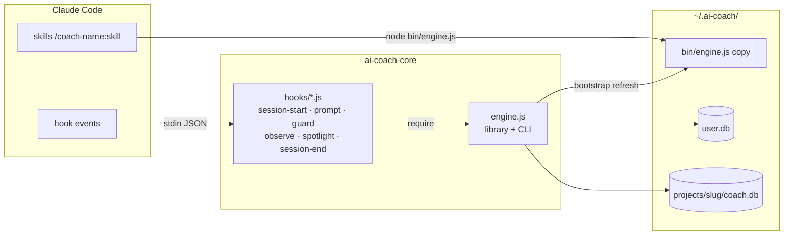
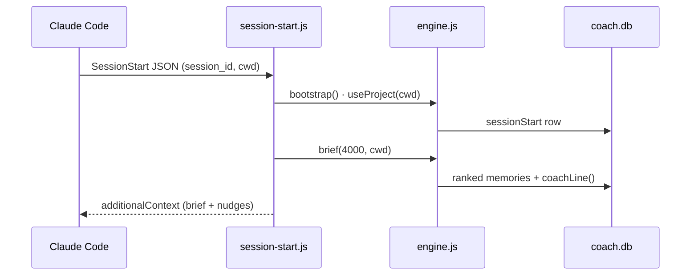

> Generated by /investigation-coach:map · 2026-08-15
---
tags: [onboarding, architecture]
---

# Architecture

Surface layer — the pieces on the core paths. Full board: architecture.canvas (open this folder
in Obsidian). Every edge below is EXTRACTED (evidence cited) unless marked INFERRED.

## Container view

## Session-start flow

## Components

| Component | Responsibility | Talks to | Evidence |
|---|---|---|---|
| engine.js | storage, ranking, seeds, detectors, findings — library AND CLI | user.db, tenant DBs | engine.js:449,543,971 |
| hooks (7) | one event each; fail open, exit 0 | engine as library | hooks.json:5-21 |
| bin/engine.js | the stable copy skills call | same DBs | engine.js:89 bootstrap() |
| memory/prompt/security/harness/investigation-coach | skills only | bin/engine.js via CLI | each plugin.json dependencies |
| ai-coach (bundle) | install story, no components | — | plugins/ai-coach/.claude-plugin/plugin.json |

Related: [[start-here]] core flows · [[02-hook-contract]].
