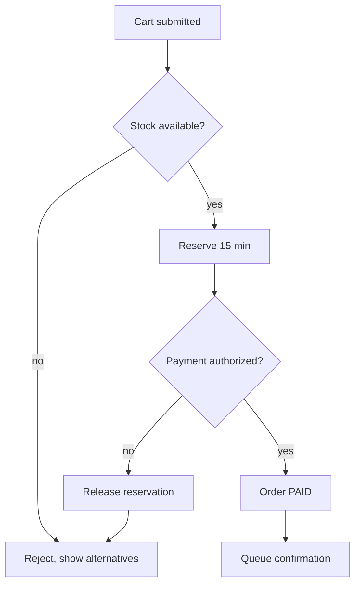

# Note formats — docs/business/

Load only when writing. Every note starts with:

```
> Generated by /strategy-coach:blueprint · YYYY-MM-DD
```

Frontmatter is limited to `tags:` and `aliases:`. Every note carries at least one outbound
wikilink. Filenames sanitize `* " \ / : | ?` to `-`.

**Evidence vocabulary**, used in every table in this file — one of these three, never blank:

| Marker | Means |
|---|---|
| `path/to/file.ts:120` | verified: this line implements the step |
| `INFERRED` | read from naming or structure, not proven |
| `NOT IN CODE` | happens in the business, has no implementation — a finding |

A claim whose only source is a person is attributed inline: `per Sara, 2026-08-20`.

## overview.md — the domain, and the hub

```markdown
> Generated by /strategy-coach:blueprint · YYYY-MM-DD
---
tags: [business, overview]
---

# <Project> — the business

**Domain:** <one sentence: what business this is in, and the sub-area covered>

**Why it exists:** <the outcome someone is paying for, in their words>

## Processes
- [[processes/order-checkout]] — from cart to a paid order
- [[processes/refund]] — reversing a settled payment, partial or full

## Reference
- [[actors]] — who uses this and what each is trying to finish
- [[glossary]] — the team's words, and their names in the code
- [[rules]] — the constraints we set, and where each is enforced
- [[industry]] — the constraints the industry sets, from `/atlas-coach:market --industry`

## What we could not determine
- <one line per open question, with who could answer it>
```

The last section is required. An overview with no open questions is a claim that the business is
fully understood, which is never true on a first pass.

## actors.md

One section per actor. Goals are what they are trying to *finish*, not features they use.

```markdown
## Warehouse operator
- **Goal:** get today's picks out before the 16:00 courier cutoff
- **Touches:** [[processes/order-fulfilment]], [[processes/stock-adjustment]]
- **Constraints:** works on a handheld scanner, one hand free, no keyboard
- **Source:** per Omar, 2026-08-20
```

## glossary.md

The most valuable note in the vault and the cheapest to write. It is how an agent stops guessing
that `txn_ref` and "payment reference" are the same thing.

| Term | What the business means | Called in code | Where |
|---|---|---|---|
| Payment reference | The number support quotes to a customer | `txn_ref` | `src/payments/types.ts:14` |
| Settled | Money has actually moved, not just authorized | `state: 'SETTLED'` | `src/payments/state.ts:31` |

## rules.md

A business rule is a constraint that can be violated. Note where it is enforced — and the
unenforced ones are the point of this table.

These are the rules *we* chose. The ones the industry imposes live in `industry.md`, written by
`/atlas-coach:market --industry`, so that a rule we invented is never confused with a rule we
must follow. A row here that turns out to be an industry requirement belongs in that file instead.

| Rule | Source | Enforced at |
|---|---|---|
| No refund above the settled amount | per Finance, 2026-08-19 | `src/refunds/validate.ts:44` |
| Bank-transfer refunds are approved by a human | per Sara, 2026-08-20 | `NOT IN CODE` — manual in the finance inbox |

## processes/&lt;name&gt;.md

Both audiences, one file. Business view first: a person reading this should not have to scroll past
code paths to understand what happens.

````markdown
> Generated by /strategy-coach:blueprint · YYYY-MM-DD
---
tags: [business, process]
aliases: [Checkout]
---

# Order checkout

**Actor:** [[actors]] — Customer · **Trigger:** cart submitted · **Done when:** order is `PAID`
and the confirmation email is queued

## Business view

1. Customer submits the cart.
2. Stock is reserved for 15 minutes.
3. Payment is authorized. Failure here releases the reservation immediately.
4. Order becomes `PAID`; confirmation is queued.

## Flow



## Technical mapping

| # | Step | Entry point | Notes |
|---|---|---|---|
| 1 | Cart submitted | `src/checkout/handler.ts:22` | validates then delegates |
| 2 | Reserve stock | `src/stock/reserve.ts:58` | TTL is 15 min, `STOCK_TTL` |
| 3 | Authorize payment | `src/payments/authorize.ts:31` | |
| 4 | Release on failure | `INFERRED` | no explicit release path found — see Unknowns |
| 5 | Queue confirmation | `src/mail/queue.ts:12` | |

## Unknowns

- Step 4: whether a failed authorization releases the reservation or waits for the TTL. Ask Omar.
````

## Mermaid rules

- Flowchart for a process, sequence diagram only when the message order between services *is* the
  point. Never both for the same process.
- Label every decision edge (`-- yes -->`), or the diagram claims a branch it does not describe.
- Keep it under ~15 nodes. A bigger diagram is two processes wearing one name — split it.
- No styling, no colors. The vault renders in Obsidian, in a pull request, and on an Artifact page,
  and each theme handles color differently.
